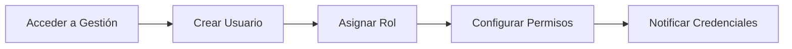
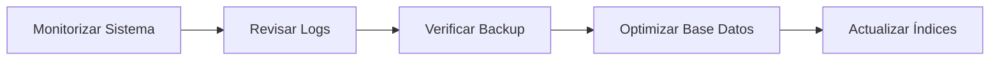

# Guía de Administración

Esta guía está dirigida a administradores del sistema nubarchiva que gestionan la configuración, usuarios y mantenimiento de la plataforma.

## ¿Para Quién es Esta Guía?

Esta sección está diseñada para:

- 🔧 Administradores del sistema
- 👥 Gestores de usuarios y permisos
- 🛠️ Responsables de mantenimiento técnico
- 📊 Supervisores de operaciones

!!! warning "Permisos Necesarios"
    Las funciones descritas en esta guía requieren permisos de administrador. Si no tienes acceso a estas opciones, contacta con el administrador principal de tu institución.

## Contenidos

### [⚙️ Configuración](configuration/index.md)

Configura el sistema según las necesidades de tu institución:

- **[Configuración general](configuration/general.md)**: Parámetros básicos del sistema
- **[Parámetros del sistema](configuration/parameters.md)**: Configuración avanzada

### [👥 Usuarios](users/index.md)

Gestiona usuarios y sus permisos:

- **[Gestión de usuarios](users/manage.md)**: Crear, editar y desactivar usuarios
- **[Roles y permisos](users/roles.md)**: Asignación de privilegios y perfiles

### [💾 Copias de Seguridad](backup/index.md)

Protege la integridad de los datos:

- **[Backup y restauración](backup/procedures.md)**: Procedimientos de respaldo

### [🔧 Mantenimiento](maintenance/index.md)

Mantén el sistema en óptimas condiciones:

- **[Tareas de mantenimiento](maintenance/tasks.md)**: Operaciones rutinarias
- **[Monitorización](maintenance/monitoring.md)**: Supervisión del sistema

## Tareas Administrativas Comunes

### Alta de Nuevo Usuario

👉 Ver: [Gestión de usuarios](users/manage.md)

### Configuración Inicial del Sistema

👉 Ver: [Configuración general](configuration/general.md)

### Mantenimiento Periódico

👉 Ver: [Tareas de mantenimiento](maintenance/tasks.md)

## Checklist del Administrador

### Tareas Diarias

- [ ] Revisar alertas del sistema
- [ ] Verificar logs de errores
- [ ] Comprobar disponibilidad del servicio

### Tareas Semanales

- [ ] Revisar usuarios activos
- [ ] Verificar backups automáticos
- [ ] Analizar estadísticas de uso

### Tareas Mensuales

- [ ] Auditoría de permisos
- [ ] Limpieza de logs antiguos
- [ ] Revisión de capacidad de almacenamiento
- [ ] Prueba de restauración de backup

### Tareas Trimestrales

- [ ] Revisión completa de configuración
- [ ] Actualización de documentación local
- [ ] Formación de nuevos usuarios
- [ ] Planificación de actualizaciones

## Buenas Prácticas

!!! tip "Documentación Local"
    Mantén documentación de las configuraciones específicas de tu instalación (nombres de servidores, rutas, contactos, etc.)

!!! tip "Backups"
    Verifica regularmente que los backups se están realizando correctamente y prueba la restauración al menos una vez al trimestre.

!!! tip "Permisos Mínimos"
    Sigue el principio de menor privilegio: asigna a los usuarios solo los permisos que realmente necesitan.

!!! tip "Cambios de Contraseña"
    Establece políticas de renovación periódica de contraseñas, especialmente para cuentas con privilegios elevados.

!!! tip "Log de Cambios"
    Mantén un registro de cambios significativos en la configuración del sistema.

## Solución de Problemas Comunes

??? question "El sistema está lento"
    - Verifica el uso de recursos del servidor
    - Revisa los logs en busca de errores
    - Comprueba el tamaño de la base de datos
    - Considera optimizar índices

    **Ver**: [Monitorización](maintenance/monitoring.md)

??? question "Un usuario no puede acceder"
    - Verifica que la cuenta esté activa
    - Comprueba que los permisos sean correctos
    - Revisa que el rol esté bien asignado
    - Verifica los logs de autenticación

    **Ver**: [Gestión de usuarios](users/manage.md)

??? question "Falló el backup automático"
    - Revisa los logs del sistema de backup
    - Verifica el espacio en disco disponible
    - Comprueba los permisos de escritura
    - Ejecuta un backup manual de prueba

    **Ver**: [Backup y restauración](backup/procedures.md)

## Contacto con Soporte Técnico

Antes de contactar con soporte técnico, ten preparada la siguiente información:

- ✅ Versión de nubarchiva instalada
- ✅ Descripción detallada del problema
- ✅ Logs relevantes del sistema
- ✅ Pasos para reproducir el error (si aplica)
- ✅ Capturas de pantalla del error

## Recursos Adicionales

- 📖 [Guía de Usuario](../user-guide/index.md) - Para conocer la perspectiva del usuario
- 🎨 [Personalización](../customization/index.md) - Para ajustes visuales y funcionales
- 🚀 [Primeros Pasos](../getting-started/index.md) - Para conceptos básicos

---

*Última actualización: 2025-11-29*
