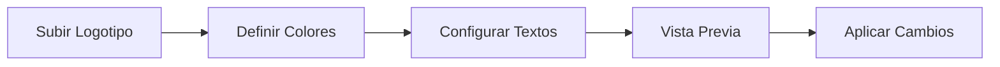
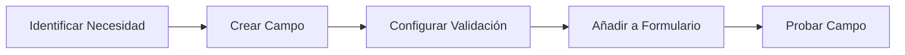
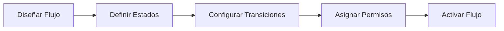

# Personalización de nubarchiva

nubarchiva es una plataforma flexible que permite adaptar su apariencia y funcionalidad a las necesidades específicas de cada institución.

## ¿Para Quién es Esta Guía?

Esta sección está dirigida a:

- 🎨 Responsables de identidad corporativa
- ⚙️ Administradores técnicos
- 📋 Gestores de procesos documentales
- 🔧 Equipos de personalización

!!! info "Nivel Técnico"
    Algunas personalizaciones requieren conocimientos técnicos avanzados. Para cambios complejos, se recomienda contactar con el equipo de soporte o desarrollo de nubarchiva.

## Contenidos

### [🎨 Configuración Visual](appearance.md)

Adapta la apariencia de la plataforma:

- Colores corporativos y temas
- Logotipos e imágenes institucionales
- Tipografías y estilos
- Plantillas de visualización

### [🔄 Flujos de Trabajo](workflows.md)

Personaliza los procesos operativos:

- Definición de flujos documentales
- Estados y transiciones
- Notificaciones automáticas
- Validaciones personalizadas

### [📝 Campos Personalizados](custom-fields.md)

Amplía el modelo de datos:

- Creación de campos específicos
- Tipos de datos personalizados
- Validaciones de entrada
- Visualización en formularios

## Niveles de Personalización

nubarchiva ofrece diferentes niveles de personalización según las necesidades:

### Nivel 1: Configuración Básica

**Disponible para**: Todos los administradores

- ✅ Cambio de logotipos
- ✅ Colores principales
- ✅ Textos de bienvenida
- ✅ Pie de página

**Sin necesidad de conocimientos técnicos**

👉 Ver: [Configuración visual básica](appearance.md#configuracion-basica)

### Nivel 2: Configuración Avanzada

**Disponible para**: Administradores con conocimientos técnicos

- ⚙️ Plantillas HTML personalizadas
- ⚙️ Hojas de estilo CSS
- ⚙️ Campos de metadatos adicionales
- ⚙️ Configuración de flujos simples

**Requiere conocimientos de HTML/CSS**

👉 Ver: [Configuración visual avanzada](appearance.md#configuracion-avanzada)

### Nivel 3: Desarrollo Personalizado

**Disponible para**: Equipos de desarrollo

- 🔧 Extensiones Java personalizadas
- 🔧 Nuevos módulos funcionales
- 🔧 Integraciones con sistemas externos
- 🔧 Flujos de trabajo complejos

**Requiere desarrollo de software**

!!! warning "Desarrollo Personalizado"
    Las personalizaciones de Nivel 3 requieren soporte técnico especializado. Contacta con el equipo de desarrollo de nubarchiva para estas necesidades.

## Casos de Uso Comunes

### Adaptar la Marca Institucional

Personaliza la plataforma con la identidad visual de tu institución:

👉 Ver: [Configuración visual](appearance.md)

### Añadir Campos Específicos

Amplía los metadatos para capturar información específica:

👉 Ver: [Campos personalizados](custom-fields.md)

### Configurar Flujo Documental

Define un proceso específico para tu organización:

👉 Ver: [Flujos de trabajo](workflows.md)

## Buenas Prácticas

### Antes de Personalizar

!!! tip "Planificación"
    Define claramente los objetivos de la personalización antes de comenzar. Documenta los requisitos y valida con los usuarios finales.

!!! tip "Entorno de Pruebas"
    Realiza siempre las personalizaciones en un entorno de pruebas antes de aplicarlas en producción.

!!! tip "Backup"
    Realiza una copia de seguridad completa antes de aplicar cambios significativos.

### Durante la Personalización

!!! tip "Documentación"
    Documenta todos los cambios realizados, incluyendo razones y fecha de aplicación.

!!! tip "Versionado"
    Si trabajas con código personalizado (CSS, plantillas), mantén un control de versiones.

!!! tip "Testing"
    Prueba exhaustivamente en diferentes navegadores y dispositivos.

### Después de Personalizar

!!! tip "Validación"
    Solicita feedback de usuarios reales antes de dar por finalizada la personalización.

!!! tip "Formación"
    Si los cambios afectan a flujos de trabajo, forma a los usuarios en los nuevos procesos.

!!! tip "Monitorización"
    Supervisa el sistema después de aplicar cambios para detectar posibles problemas.

## Limitaciones y Consideraciones

### Limitaciones Técnicas

- ⚠️ Algunos aspectos del núcleo del sistema no son personalizables
- ⚠️ Las personalizaciones muy profundas pueden afectar a futuras actualizaciones
- ⚠️ Ciertos cambios requieren reinicio del sistema

### Consideraciones de Rendimiento

- 📊 Demasiados campos personalizados pueden ralentizar los formularios
- 📊 Flujos muy complejos pueden afectar al rendimiento
- 📊 Plantillas visuales pesadas aumentan el tiempo de carga

### Compatibilidad con Actualizaciones

!!! warning "Actualizaciones del Sistema"
    Las personalizaciones muy específicas pueden requerir adaptación cuando se actualice nubarchiva a una nueva versión. Se recomienda:

    - Usar siempre que sea posible los mecanismos oficiales de personalización
    - Documentar las personalizaciones realizadas
    - Probar las personalizaciones después de cada actualización

## Soporte para Personalización

### Soporte Incluido

✅ Configuración visual básica (logos, colores)
✅ Configuración de campos estándar
✅ Documentación y guías

### Soporte Bajo Demanda

💼 Personalizaciones avanzadas
💼 Desarrollo de extensiones
💼 Integraciones con sistemas externos
💼 Formación específica

## Casos de Éxito

!!! example "Ejemplo: Archivo Municipal"
    Un archivo municipal configuró campos personalizados para registrar información específica de expedientes urbanísticos, incluyendo referencia catastral, dirección completa y tipo de licencia.

    **Resultado**: Reducción del 40% en tiempo de búsqueda de expedientes.

!!! example "Ejemplo: Archivo Provincial"
    Una diputación provincial personalizó el flujo de trabajo para gestionar préstamos de documentación entre diferentes dependencias, con notificaciones automáticas y control de plazos.

    **Resultado**: Mejora en el control y trazabilidad de documentos en préstamo.

!!! example "Ejemplo: Fototeca"
    Una fototeca histórica adaptó las plantillas de visualización para mostrar información específica de fotografías antiguas, incluyendo técnica fotográfica, estado de conservación y datos de digitalización.

    **Resultado**: Experiencia de usuario más rica y accesibilidad mejorada para investigadores.

## Siguiente Paso

Elige el área de personalización que necesitas:

- 🎨 **[Configuración Visual](appearance.md)** - Adapta la apariencia
- 🔄 **[Flujos de Trabajo](workflows.md)** - Personaliza procesos
- 📝 **[Campos Personalizados](custom-fields.md)** - Amplía metadatos

---

*Última actualización: 2025-11-29*
