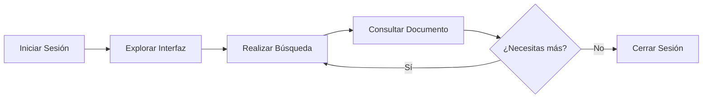

# Primeros Pasos con nubarchiva

Bienvenido a nubarchiva. Esta guía te ayudará a familiarizarte con el sistema y realizar tus primeras tareas.

## ¿Qué Aprenderás?

En esta sección encontrarás:

- 🔐 [**Acceso al sistema**](login.md): Cómo iniciar sesión y gestionar tu cuenta
- 🖥️ [**Interfaz principal**](interface.md): Descripción de la interfaz y sus elementos
- 📚 [**Conceptos básicos**](concepts.md): Terminología archivística fundamental

## Antes de Empezar

Para utilizar nubarchiva necesitas:

1. **Instalación de nubarchiva**:
   - Si eres **administrador**, consulta la [Guía de Instalación](../installation/index.md)
   - Si eres **usuario** de una instalación existente, solicita credenciales al administrador
2. **Navegador web moderno**: Chrome, Firefox, Safari o Edge actualizados
3. **Conexión a internet**: Estable para una experiencia óptima

!!! tip "Recomendación"
    Se recomienda utilizar una pantalla con resolución mínima de 1024x768 píxeles para una mejor experiencia de usuario.

## Flujo de Trabajo Típico

## Próximos Pasos

Una vez completada esta sección, estarás listo para:

- 🔍 [Buscar documentos](../user-guide/search/index.md)
- 📄 [Visualizar y descargar contenidos](../user-guide/documents/index.md)
- 📁 [Crear colecciones personalizadas](../user-guide/collections/index.md)

## Necesitas Ayuda

Si encuentras dificultades durante este proceso inicial:

- 💬 [Foro de la comunidad](https://community.nubarchiva.org) _(próximamente)_
- 📖 [Documentación completa](https://docs.nubarchiva.org)
- 🐛 [Reportar problema](https://github.com/nubarchiva/nubarchiva/issues) _(próximamente público)_

---

**👉 Comienza por**: [Acceso al sistema](login.md)

---

*Última actualización: 2025-11-29*
