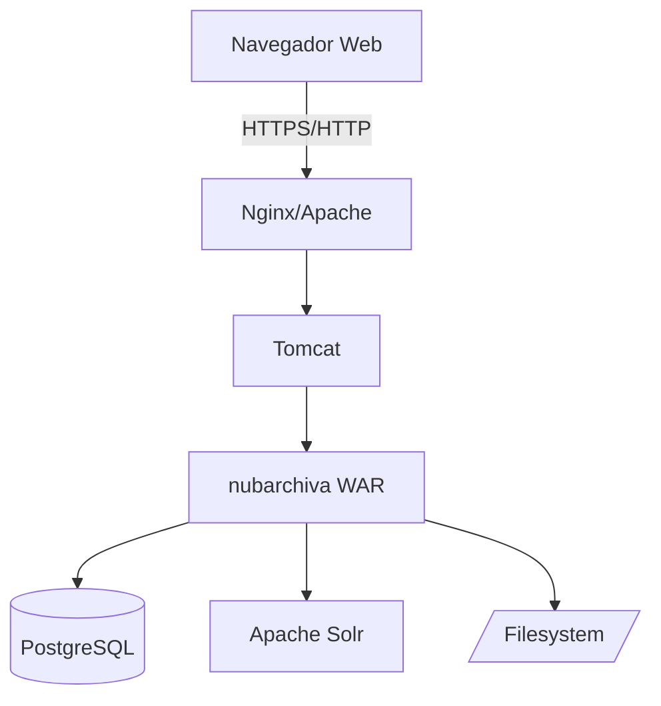

# Instalación Manual (Bare Metal)

Guía completa para instalar nubarchiva directamente en un servidor Linux, sin contenedores.

**Ideal para**: Producción, control total, personalizaciones avanzadas

## 📋 Antes de Empezar

Verifica que cumples los [requisitos del sistema](../requirements.md).

**Tiempo estimado**: 1-2 horas

## 🏗️ Arquitectura de Componentes



## 📦 Paso 1: Preparar el Sistema

### Actualizar Sistema

```bash
# Ubuntu/Debian
sudo apt update && sudo apt upgrade -y

# Red Hat/CentOS
sudo yum update -y
```

### Instalar Utilidades Básicas

```bash
# Ubuntu/Debian
sudo apt install -y curl wget git unzip build-essential

# Red Hat/CentOS
sudo yum install -y curl wget git unzip gcc
```

### Crear Usuario del Sistema

```bash
sudo useradd -r -m -U -d /opt/nubarchiva -s /bin/bash nubarchiva
```

## ☕ Paso 2: Instalar Java

### Instalar OpenJDK

```bash
# Ubuntu/Debian - Java 11
sudo apt install -y openjdk-11-jdk

# Red Hat/CentOS - Java 11
sudo yum install -y java-11-openjdk-devel

# Verificar
java -version
```

### Configurar JAVA_HOME

```bash
# Encontrar ruta
readlink -f $(which java)

# Añadir a /etc/environment
echo 'JAVA_HOME="/usr/lib/jvm/java-11-openjdk-amd64"' | sudo tee -a /etc/environment
source /etc/environment
```

## 🗄️ Paso 3: Instalar PostgreSQL

Ver guía detallada: **[Instalación PostgreSQL](../database/postgresql.md)**

Resumen rápido:

```bash
# Ubuntu/Debian
sudo apt install -y postgresql postgresql-contrib

# Red Hat/CentOS
sudo yum install -y postgresql-server postgresql-contrib
sudo postgresql-setup --initdb
sudo systemctl enable postgresql
sudo systemctl start postgresql
```

### Crear Base de Datos

```bash
sudo -u postgres psql <<EOF
CREATE DATABASE nubarchiva
    WITH ENCODING='UTF8'
    LC_COLLATE='es_ES.UTF-8'
    LC_CTYPE='es_ES.UTF-8';

CREATE USER nubarchiva_user WITH PASSWORD 'password_seguro_aqui';
GRANT ALL PRIVILEGES ON DATABASE nubarchiva TO nubarchiva_user;
\q
EOF
```

### Verificar Conexión

```bash
psql -U nubarchiva_user -d nubarchiva -h localhost -c "SELECT version();"
```

## 🔍 Paso 4: Instalar Apache Solr

Ver guía detallada: **[Instalación Solr](../search/solr.md)**

Resumen rápido:

```bash
# Descargar Solr 3.5 (versión validada)
cd /tmp
wget https://archive.apache.org/dist/lucene/solr/3.5.0/apache-solr-3.5.0.tgz
tar xzf apache-solr-3.5.0.tgz
sudo mv apache-solr-3.5.0 /opt/solr
sudo chown -R nubarchiva:nubarchiva /opt/solr
```

### Configurar Solr

```bash
# Crear core de nubarchiva
sudo -u nubarchiva mkdir -p /opt/solr/cores/nubarchiva
# Copiar configuración (desde repositorio nubarchiva)
```

### Crear Servicio Systemd

```bash
sudo tee /etc/systemd/system/solr.service > /dev/null <<EOF
[Unit]
Description=Apache Solr
After=network.target

[Service]
Type=forking
User=nubarchiva
Environment="JAVA_HOME=/usr/lib/jvm/java-11-openjdk-amd64"
ExecStart=/opt/solr/bin/solr start
ExecStop=/opt/solr/bin/solr stop
Restart=on-failure

[Install]
WantedBy=multi-user.target
EOF

sudo systemctl daemon-reload
sudo systemctl enable solr
sudo systemctl start solr
```

### Verificar

```bash
curl http://localhost:8983/solr/admin/ping
```

## 🌐 Paso 5: Instalar Tomcat

Ver guía detallada: **[Instalación Tomcat](../app-server/tomcat.md)**

Resumen rápido:

```bash
# Descargar Tomcat 9
cd /tmp
wget https://dlcdn.apache.org/tomcat/tomcat-9/v9.0.82/bin/apache-tomcat-9.0.82.tar.gz
tar xzf apache-tomcat-9.0.82.tar.gz
sudo mv apache-tomcat-9.0.82 /opt/tomcat
sudo chown -R nubarchiva:nubarchiva /opt/tomcat
```

### Configurar Tomcat

Editar `/opt/tomcat/bin/setenv.sh`:

```bash
#!/bin/bash
export JAVA_HOME=/usr/lib/jvm/java-11-openjdk-amd64
export CATALINA_PID=/opt/tomcat/temp/tomcat.pid
export CATALINA_OPTS="-Xms2g -Xmx4g -XX:+UseG1GC -XX:MaxGCPauseMillis=200"
export JAVA_OPTS="$JAVA_OPTS -Djava.awt.headless=true"
export JAVA_OPTS="$JAVA_OPTS -Dfile.encoding=UTF-8"
export JAVA_OPTS="$JAVA_OPTS -Dnubarchiva.config=/etc/nubarchiva/nubarchiva.properties"
```

```bash
sudo chmod +x /opt/tomcat/bin/setenv.sh
```

### Crear Servicio Systemd

```bash
sudo tee /etc/systemd/system/tomcat.service > /dev/null <<EOF
[Unit]
Description=Apache Tomcat
After=network.target

[Service]
Type=forking
User=nubarchiva
Group=nubarchiva
Environment="JAVA_HOME=/usr/lib/jvm/java-11-openjdk-amd64"
Environment="CATALINA_HOME=/opt/tomcat"
Environment="CATALINA_BASE=/opt/tomcat"
ExecStart=/opt/tomcat/bin/startup.sh
ExecStop=/opt/tomcat/bin/shutdown.sh
Restart=on-failure

[Install]
WantedBy=multi-user.target
EOF

sudo systemctl daemon-reload
sudo systemctl enable tomcat
```

## 📁 Paso 6: Preparar Directorios

```bash
# Crear directorios
sudo mkdir -p /var/nubarchiva/files
sudo mkdir -p /var/log/nubarchiva
sudo mkdir -p /etc/nubarchiva

# Permisos
sudo chown -R nubarchiva:nubarchiva /var/nubarchiva
sudo chown -R nubarchiva:nubarchiva /var/log/nubarchiva
sudo chown -R nubarchiva:nubarchiva /etc/nubarchiva
```

## ⚙️ Paso 7: Compilar nubarchiva

### Instalar Maven

```bash
# Ubuntu/Debian
sudo apt install -y maven

# Red Hat/CentOS
sudo yum install -y maven

# Verificar
mvn -version
```

### Clonar y Compilar

```bash
# Clonar repositorio
cd /tmp
git clone https://github.com/nubarchiva/nuba-oss.git
cd nubarchiva

# Compilar
mvn clean install -DskipTests

# El WAR estará en target/nubarchiva.war
```

## 🔧 Paso 8: Configurar nubarchiva

### Crear Archivo de Configuración

```bash
sudo tee /etc/nubarchiva/nubarchiva.properties > /dev/null <<EOF
# Base de datos
db.driver=org.postgresql.Driver
db.url=jdbc:postgresql://localhost:5432/nubarchiva
db.username=nubarchiva_user
db.password=password_seguro_aqui

# Solr
solr.url=http://localhost:8983/solr/nubarchiva

# Directorios
files.path=/var/nubarchiva/files
temp.path=/var/nubarchiva/temp
logs.path=/var/log/nubarchiva

# Aplicación
app.name=nubarchiva
app.url=http://localhost:8080/nubarchiva
app.timezone=Europe/Madrid

# Sesión
session.timeout=30

# Multi-institución (opcional)
multi-institución.enabled=false

# Email (opcional)
mail.host=localhost
mail.port=25
mail.from=noreply@nubarchiva.es
EOF

sudo chown nubarchiva:nubarchiva /etc/nubarchiva/nubarchiva.properties
sudo chmod 600 /etc/nubarchiva/nubarchiva.properties
```

## 🚀 Paso 9: Desplegar Aplicación

```bash
# Copiar WAR a Tomcat
sudo cp /tmp/nubarchiva/target/nubarchiva.war /opt/tomcat/webapps/
sudo chown nubarchiva:nubarchiva /opt/tomcat/webapps/nubarchiva.war

# Iniciar Tomcat
sudo systemctl start tomcat

# Ver logs
sudo tail -f /opt/tomcat/logs/catalina.out
```

## 🗃️ Paso 10: Inicializar Base de Datos

```bash
# Ejecutar scripts de inicialización
psql -U nubarchiva_user -d nubarchiva -h localhost < /tmp/nubarchiva/sql/schema.sql
psql -U nubarchiva_user -d nubarchiva -h localhost < /tmp/nubarchiva/sql/data.sql
```

## ✅ Paso 11: Verificar Instalación

### Verificar Servicios

```bash
# PostgreSQL
sudo systemctl status postgresql

# Solr
sudo systemctl status solr
curl http://localhost:8983/solr/admin/ping

# Tomcat
sudo systemctl status tomcat
curl http://localhost:8080
```

### Acceder a nubarchiva

Abre navegador en: [http://localhost:8080/nubarchiva](http://localhost:8080/nubarchiva)

**Credenciales por defecto**:
- Usuario: `admin`
- Contraseña: `admin`

!!! danger "Cambiar Credenciales"
    Cambia inmediatamente las credenciales por defecto.

## 🔒 Paso 12: Seguridad Post-Instalación

### Cambiar Contraseña Admin

1. Inicia sesión como `admin`
2. Ve a: Administración > Usuarios
3. Selecciona usuario `admin`
4. Cambia contraseña

### Configurar Firewall

```bash
# UFW (Ubuntu)
sudo ufw allow 22/tcp    # SSH
sudo ufw allow 80/tcp    # HTTP
sudo ufw allow 443/tcp   # HTTPS
sudo ufw enable

# FirewallD (Red Hat/CentOS)
sudo firewall-cmd --permanent --add-service=http
sudo firewall-cmd --permanent --add-service=https
sudo firewall-cmd --permanent --add-service=ssh
sudo firewall-cmd --reload
```

### Configurar SSL/TLS

Ver: **[Configuración SSL/TLS](../configuration/ssl.md)**

### Restringir Acceso a Servicios

```bash
# PostgreSQL: solo localhost
# Editar /etc/postgresql/*/main/pg_hba.conf
sudo nano /etc/postgresql/15/main/pg_hba.conf

# Cambiar:
# host    all    all    0.0.0.0/0    md5
# Por:
# host    all    all    127.0.0.1/32    md5

sudo systemctl restart postgresql
```

## 🔄 Paso 13: Configurar Backups

Ver guía detallada: **[Backups y Restauración](../../admin-guide/backup/procedures.md)**

Script básico:

```bash
sudo tee /usr/local/bin/nubarchiva-backup.sh > /dev/null <<'EOF'
#!/bin/bash
BACKUP_DIR=/backups/nubarchiva
DATE=$(date +%Y%m%d-%H%M%S)
mkdir -p $BACKUP_DIR

# Backup base de datos
pg_dump -U nubarchiva_user -h localhost nubarchiva | \
  gzip > $BACKUP_DIR/db-$DATE.sql.gz

# Backup archivos
tar czf $BACKUP_DIR/files-$DATE.tar.gz -C /var/nubarchiva files

# Backup configuración
tar czf $BACKUP_DIR/config-$DATE.tar.gz -C /etc nubarchiva

# Retener 30 días
find $BACKUP_DIR -name "*.gz" -mtime +30 -delete

echo "Backup completado: $DATE"
EOF

sudo chmod +x /usr/local/bin/nubarchiva-backup.sh
```

Automatizar con cron:

```bash
sudo crontab -e
# Añadir:
0 2 * * * /usr/local/bin/nubarchiva-backup.sh >> /var/log/nubarchiva-backup.log 2>&1
```

## 📊 Paso 14: Monitorización

### Logs

```bash
# Logs de aplicación
tail -f /var/log/nubarchiva/application.log

# Logs de Tomcat
tail -f /opt/tomcat/logs/catalina.out

# Logs de PostgreSQL
sudo tail -f /var/log/postgresql/postgresql-15-main.log
```

### Espacio en Disco

```bash
# Uso general
df -h

# Uso de directorios nubarchiva
du -sh /var/nubarchiva/*
```

### Recursos del Sistema

```bash
# Instalar htop
sudo apt install htop   # Ubuntu/Debian
sudo yum install htop   # Red Hat/CentOS

htop
```

## 🔄 Actualizaciones

Para actualizar a una nueva versión:

1. **Backup completo**
2. **Descargar nueva versión**
3. **Detener Tomcat**: `sudo systemctl stop tomcat`
4. **Backup WAR actual**: `cp /opt/tomcat/webapps/nubarchiva.war /backups/`
5. **Desplegar nuevo WAR**: `cp nuevo-nubarchiva.war /opt/tomcat/webapps/nubarchiva.war`
6. **Ejecutar scripts de migración** (si aplica)
7. **Iniciar Tomcat**: `sudo systemctl start tomcat`
8. **Verificar logs**: `tail -f /opt/tomcat/logs/catalina.out`

Ver: **[Guía de Actualización](../upgrade.md)**

## 🐛 Solución de Problemas

Ver: **[Troubleshooting](../troubleshooting.md)**

### Tomcat no inicia

```bash
# Verificar logs
sudo journalctl -u tomcat -n 50

# Verificar Java
java -version

# Verificar permisos
ls -la /opt/tomcat/webapps/
```

### Error de conexión a BD

```bash
# Verificar PostgreSQL
sudo systemctl status postgresql

# Probar conexión
psql -U nubarchiva_user -d nubarchiva -h localhost

# Verificar configuración
cat /etc/nubarchiva/nubarchiva.properties | grep db
```

## 📚 Siguientes Pasos

- **[Configuración básica](../configuration/basic.md)**
- **[Gestión de usuarios](../../admin-guide/users/index.md)**
- **[Personalización](../../customization/index.md)**

---

*Última actualización: 2025-11-29*
