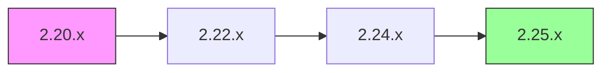

# Matriz de Compatibilidad

Tabla de compatibilidad entre versiones de nubarchiva y sus dependencias.

## 🔄 Paths de Actualización Soportados

### Actualizaciones Directas

| Desde    | Hasta    | Soportado | Downtime | Complejidad | Notas                           |
|----------|----------|-----------|----------|-------------|---------------------------------|
| 2.25.0   | 2.25.1   | ✅ Sí     | Mínimo   | Baja        | Patch release                   |
| 2.24.x   | 2.25.x   | ✅ Sí     | Moderado | Media       | Minor release                   |
| 2.23.x   | 2.25.x   | ✅ Sí     | Moderado | Media       | Puede requerir 2 pasos          |
| 2.22.x   | 2.25.x   | ⚠️ No rec.| Alto     | Alta        | Actualizar primero a 2.24       |
| 2.20.x   | 2.25.x   | ❌ No     | -        | -           | Actualización escalonada requerida |
| 2.x      | 3.x      | ⚠️ Especial| Muy alto | Muy alta   | Ver guía específica             |

### Actualizaciones Escalonadas

Para versiones con gran diferencia, se requiere actualización por etapas:



**Ejemplo**: 2.20 → 2.25
1. 2.20.x → 2.22.x
2. 2.22.x → 2.24.x
3. 2.24.x → 2.25.x

## 🗓️ Versiones y Soporte

| Versión | Release    | EOL        | Estado      | Soporte          |
|---------|------------|------------|-------------|------------------|
| 3.0     | Q2 2026    | -          | Desarrollo  | -                |
| 2.26    | Q1 2026    | Q1 2028    | Planificado | -                |
| 2.25    | Q4 2025    | Q4 2027    | Actual      | ✅ Completo      |
| 2.24    | Q2 2025    | Q2 2027    | Estable     | ✅ Completo      |
| 2.23    | Q4 2024    | Q4 2026    | Mantenimiento| ⚠️ Solo crítico |
| 2.22    | Q2 2024    | Q2 2026    | Mantenimiento| ⚠️ Solo crítico |
| 2.21    | Q4 2023    | Q4 2025    | EOL pronto  | ⚠️ Solo seguridad|
| 2.20    | Q2 2023    | Q2 2025    | EOL pronto  | ⚠️ Solo seguridad|
| < 2.20  | -          | Pasado     | EOL         | ❌ Sin soporte   |

!!! warning "End of Life (EOL)"
    Las versiones en EOL no reciben actualizaciones de seguridad. Actualiza lo antes posible.

## ☕ Compatibilidad Java

| nubarchiva | Java 8 | Java 11 | Java 17 | Java 21 |
|------------|--------|---------|---------|---------|
| 3.0        | ❌     | ✅      | ✅      | ✅      |
| 2.26       | ⚠️     | ✅      | ✅      | ⚠️      |
| 2.25       | ✅     | ✅      | ✅      | ❌      |
| 2.24       | ✅     | ✅      | ✅      | ❌      |
| 2.23       | ✅     | ✅      | ⚠️      | ❌      |
| < 2.23     | ✅     | ✅      | ❌      | ❌      |

**Leyenda**:
- ✅ Soportado y probado
- ⚠️ Compatible pero no recomendado
- ❌ No soportado

## 🗄️ Compatibilidad PostgreSQL

| nubarchiva | PG 12 | PG 13 | PG 14 | PG 15 | PG 16 |
|------------|-------|-------|-------|-------|-------|
| 3.0        | ⚠️    | ✅    | ✅    | ✅    | ✅    |
| 2.26       | ⚠️    | ✅    | ✅    | ✅    | ✅    |
| 2.25       | ✅    | ✅    | ✅    | ✅    | ✅    |
| 2.24       | ✅    | ✅    | ✅    | ✅    | ⚠️    |
| 2.23       | ✅    | ✅    | ✅    | ⚠️    | ❌    |
| < 2.23     | ✅    | ✅    | ⚠️    | ❌    | ❌    |

## 🔍 Compatibilidad Apache Solr

| nubarchiva | Solr 3.5 | Solr 4.x | Solr 8.x | Solr 9.x |
|------------|----------|----------|----------|----------|
| 3.0        | ❌       | ❌       | ✅       | ✅       |
| 2.26       | ⚠️       | ✅       | ✅       | ⚠️       |
| 2.25       | ✅       | ⚠️       | ❌       | ❌       |
| 2.24       | ✅       | ⚠️       | ❌       | ❌       |
| < 2.24     | ✅       | ❌       | ❌       | ❌       |

!!! info "Migración Solr"
    La migración de Solr 3.5 a 8.x+ requiere reindexación completa. Ver guía específica.

## 🌐 Compatibilidad Tomcat

| nubarchiva | Tomcat 8.5 | Tomcat 9 | Tomcat 10 |
|------------|------------|----------|-----------|
| 3.0        | ❌         | ✅       | ✅        |
| 2.26       | ⚠️         | ✅       | ⚠️        |
| 2.25       | ✅         | ✅       | ❌        |
| 2.24       | ✅         | ✅       | ❌        |
| < 2.24     | ✅         | ✅       | ❌        |

## 🐳 Compatibilidad Docker

| nubarchiva | Docker Engine | Docker Compose |
|------------|---------------|----------------|
| 3.0        | 20.10+        | 2.0+           |
| 2.25       | 20.10+        | 2.0+           |
| 2.24       | 19.03+        | 1.27+          |
| < 2.24     | 19.03+        | 1.27+          |

## 💻 Compatibilidad Sistema Operativo

### Linux

| OS                  | 2.24 | 2.25 | 3.0  |
|---------------------|------|------|------|
| Ubuntu 20.04 LTS    | ✅   | ✅   | ✅   |
| Ubuntu 22.04 LTS    | ✅   | ✅   | ✅   |
| Debian 11           | ✅   | ✅   | ✅   |
| Debian 12           | ⚠️   | ✅   | ✅   |
| RHEL 8.x            | ✅   | ✅   | ✅   |
| RHEL 9.x            | ⚠️   | ✅   | ✅   |
| Rocky Linux 8/9     | ✅   | ✅   | ✅   |
| Amazon Linux 2      | ✅   | ✅   | ⚠️   |
| Amazon Linux 2023   | ⚠️   | ✅   | ✅   |

### Windows Server

| OS                  | 2.24 | 2.25 | 3.0  |
|---------------------|------|------|------|
| Windows Server 2019 | ⚠️   | ⚠️   | ❌   |
| Windows Server 2022 | ⚠️   | ⚠️   | ❌   |

!!! warning "Windows"
    Soporte Windows solo para desarrollo. No recomendado para producción.

## 📊 Requisitos de Migración

### Migraciones de Base de Datos

| Desde | Hasta | Scripts DDL | Scripts DML | Tiempo Estimado |
|-------|-------|-------------|-------------|-----------------|
| 2.24  | 2.25  | Sí (3)      | Sí (2)      | 5-10 min        |
| 2.23  | 2.24  | Sí (5)      | Sí (3)      | 10-15 min       |
| 2.22  | 2.23  | Sí (2)      | No          | 5 min           |

**Ubicación scripts**: `sql/migrations/VERSION/`

### Cambios de Configuración

| Desde | Hasta | Config Changes | Breaking | Notas                              |
|-------|-------|----------------|----------|------------------------------------|
| 2.24  | 2.25  | 3 nuevos params| No       | Valores por defecto compatibles    |
| 2.23  | 2.24  | 1 param removed| Sí       | Requiere ajuste manual             |
| 2.22  | 2.23  | 2 nuevos params| No       | Opcional, mejora rendimiento       |

## 🔐 Compatibilidad de Datos

### Formatos de Backup

| Versión Backup | Compatible con          |
|----------------|-------------------------|
| 2.25           | 2.25, 2.24              |
| 2.24           | 2.25, 2.24, 2.23        |
| 2.23           | 2.24, 2.23              |
| < 2.23         | Solo misma versión      |

### Rollback Support

| Upgrade      | Rollback Soportado | Requiere Restore | Notas                    |
|--------------|--------------------| -----------------|--------------------------|
| 2.24 → 2.25  | ✅ Sí             | No               | Si no hay cambios de esquema |
| 2.23 → 2.24  | ⚠️ Parcial        | Sí               | Requiere restore de BD   |
| 2.x → 3.x    | ❌ No             | Sí               | Migración one-way        |

## 📋 Matriz de Decisión

**¿Puedo actualizar directamente?**

```
┌─ ¿Diferencia de versión > 2 minor releases?
│  ├─ SÍ → Actualización escalonada requerida
│  └─ NO → ¿Es major version upgrade (2.x → 3.x)?
│          ├─ SÍ → Ver guía específica de major upgrade
│          └─ NO → ¿Tienes backup completo?
│                  ├─ SÍ → ✅ Puedes actualizar directamente
│                  └─ NO → ❌ HAZ BACKUP PRIMERO
```

## 🆘 Obtener Ayuda

¿No estás seguro de tu path de actualización?

- 💬 [Foro de la comunidad](https://groups.google.com/a/nubarchiva.es/g/community)
- 📧 [Soporte empresarial](mailto:hello@nubarchiva.es)

---

*Última actualización: 2025-11-29*
