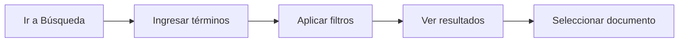
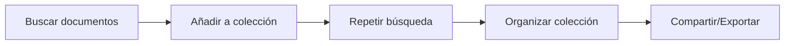
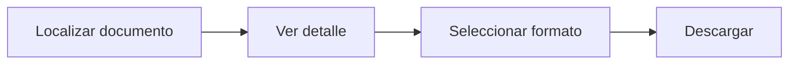

# Guía de Usuario

Esta guía está diseñada para usuarios que necesitan consultar, buscar y trabajar con documentos en nubarchiva.

## ¿Para Quién es Esta Guía?

Esta sección está dirigida a:

- 👤 Ciudadanos que consultan el catálogo público
- 🔍 Investigadores que buscan información específica
- 📚 Usuarios registrados que gestionan colecciones personales

## Contenidos

### [🧭 Navegación](navigation/index.md)

Aprende a moverte por la interfaz de nubarchiva:

- Menú principal y sus opciones
- Barras de herramientas
- Atajos de teclado

### [🔍 Búsqueda](search/index.md)

Encuentra documentos de manera eficiente:

- **[Búsqueda simple](search/simple.md)**: Para consultas rápidas
- **[Búsqueda avanzada](search/advanced.md)**: Con múltiples criterios
- **[Filtros y facetas](search/filters.md)**: Refina tus resultados

### [📄 Documentos](documents/index.md)

Trabaja con los documentos encontrados:

- **[Visualizar documentos](documents/view.md)**: Consulta la información
- **[Descargar documentos](documents/download.md)**: Guarda copias locales
- **[Compartir documentos](documents/share.md)**: Comparte enlaces permanentes

### [📁 Colecciones](collections/index.md)

Organiza documentos de interés:

- **[Crear colecciones](collections/create.md)**: Agrupa documentos relacionados
- **[Gestionar colecciones](collections/manage.md)**: Edita y organiza tus colecciones

## Casos de Uso Comunes

### Buscar un Documento Específico

**👉 Empieza aquí**: [Búsqueda simple](search/simple.md)

### Crear una Colección Temática

**👉 Empieza aquí**: [Crear colecciones](collections/create.md)

### Descargar Documentación

**👉 Empieza aquí**: [Descargar documentos](documents/download.md)

## Consejos Rápidos

!!! tip "Búsqueda Eficiente"
    Utiliza comillas para buscar frases exactas: `"registro civil"`

!!! tip "Navegación Rápida"
    Usa el historial del navegador para volver a búsquedas anteriores

!!! tip "Favoritos"
    Marca documentos frecuentes añadiéndolos a una colección "Favoritos"

## Atajos de Teclado

| Atajo | Acción |
|-------|--------|
| `Ctrl + F` / `Cmd + F` | Búsqueda rápida en la página |
| `Escape` | Cerrar ventanas modales |
| `Tab` | Navegar entre campos de formulario |

## Preguntas Frecuentes

??? question "¿Puedo descargar múltiples documentos a la vez?"
    Actualmente, las descargas se realizan documento por documento. Puedes crear una colección para agruparlos y descargar la lista.

??? question "¿Los resultados de búsqueda tienen límite?"
    Sí, por defecto se muestran los primeros 100 resultados. Utiliza filtros para refinar tu búsqueda.

??? question "¿Necesito cuenta para buscar documentos?"
    No, el catálogo público es accesible sin autenticación. Solo necesitas cuenta para funciones avanzadas como crear colecciones.

## Siguiente Paso

¿Primera vez usando nubarchiva? **👉 [Primeros Pasos](../getting-started/index.md)**

¿Ya conoces lo básico? **👉 Comienza con [Navegación](navigation/index.md) o [Búsqueda](search/index.md)**

---

*Última actualización: 2025-11-29*
